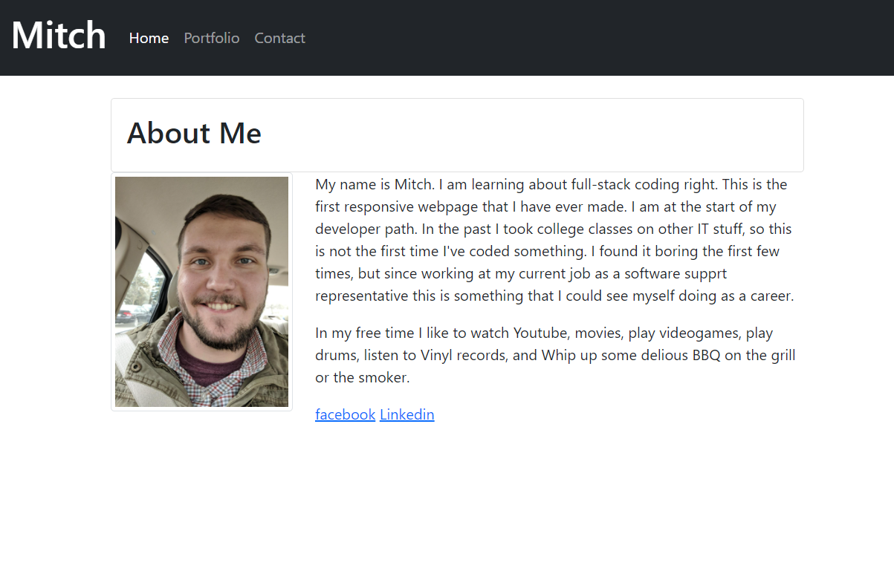

# MyResponsivePortfolio

## Description 

This website is a portfolio of myself. At the moment I don't have much to add to it as I have not done many projects yet. This will be updated to as projects are completed. 

Within this portfolio is a navbar at the top of the page with working links to each of the pages on the site. The home button and "Mitch" in the navbar will both take you to the "About Me" page of the site. 

The Portfolio link displays some screenshots of the projects I have done(as perviosly stated I'm new so none yet). Screenshots of some of my projects will be added herre in the future.

The contact page show a couple of form input spaces where is someone would like to contact me they can enter their information as well as a message and click on the submit button to send it to me(the submit button does nothing at this time).

## Features

Navbar with working links
2 Form inputs
form text input
A button(does not work)
Responsive layout
links to social media
Uses Bootstrap

## Link to Page

## Picture of Page

## Credits

https://github.com/Thaguy195/